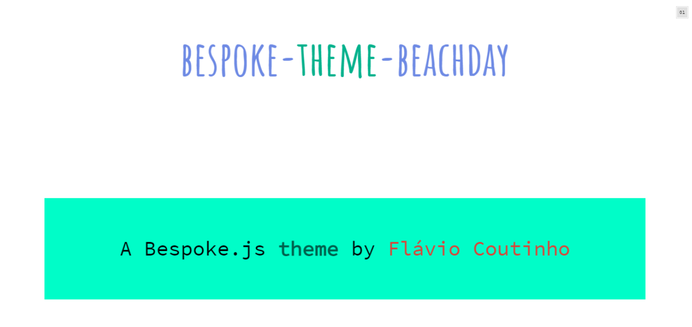

# bespoke-theme-beachday

A cheerful theme for [Bespoke.js](http://markdalgleish.com/projects/bespoke.js)
inspired by a Google Presentations theme &mdash; 
[View demo](http://fegemo.github.io/bespoke-theme-beachday)


## Download

Download the [production version][min] or the [development version][max],
or use a [package manager](#package-managers).

[min]: https://raw.github.com/fegemo/bespoke-theme-beachday/master/dist/bespoke-theme-beachday.min.js
[max]: https://raw.github.com/fegemo/bespoke-theme-beachday/master/dist/bespoke-theme-beachday.js

## Usage

This theme is shipped in two ways:

1. in a [UMD format](https://github.com/umdjs/umd) and
1. as CSS files inside [dist/theme](dist/theme).

If you prefer to include it by requiring some JS file, you can use (1) as it makes the theme available as a CommonJS/AMD module or browser global.

For example, when using CommonJS modules:

```js
const bespoke = require('bespoke')
const beachday = require('bespoke-theme-beachday');

bespoke.from('#presentation', [
  beachday()
])
```

When using browser globals:

```js
bespoke.from('#presentation', [
  bespoke.themes.beachday()
])
```

Alternatively, if you prefer to include (2) CSS files directly, you can grab them from [dist/theme](dist/theme) directly. Reasons for this include if you strive for better performance, as loading the theme via (1) involves parsing a JS file before any CSS is included.

## Package managers

### npm

```bash
$ npm install bespoke-theme-beachday
```

## Credits

This theme was built with 
[generator-bespoketheme](https://github.com/markdalgleish/generator-bespoketheme).

## License

[MIT License](http://en.wikipedia.org/wiki/MIT_License)
